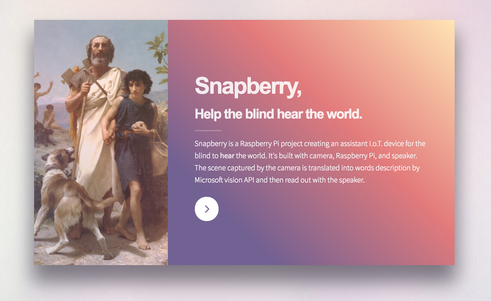

# Snapberry



## Snapberry: Help the blind hear the world.

[Snapberry](http://wanghong-yang.github.io/Snapberry/) is a Raspberry Pi project creating an assistant I.o.T. device for the blind to hear the world. It's built with camera, Raspberry Pi, and speaker. The scene captured by the camera is translated into words description by Microsoft vision API and then read out with the speaker. 

## Run

```
// package dependencies
npm install

// webpack & start the server
npm run dev

// start a simple HTTP server
npm run start

// now the page can be viewed at http://localhost:8000
```

## Project Page

Project introduction page is [here](http://wanghong-yang.github.io/Snapberry/).

## Framework

+ Backend
  + [Node.js](https://nodejs.org/)
  + [Express](http://expressjs.com/)
  + [Node-RaspiCam](https://github.com/troyth/node-raspicam)
+ Frontend
  + [Webpack](https://webpack.github.io/)
  + [npm](https://www.npmjs.com/)
  + [Babel](https://babeljs.io/)
  + [SASS](http://sass-lang.com/)
+ Other
  + [Microsoft Vision API](https://www.microsoft.com/cognitive-services/en-us/computer-vision-api)
  + [Responsive Voice Text to Speech API](https://responsivevoice.org/)
  + [Template HTML5 UP](https://html5up.net/)

## Contact

+ Email: hongyang.wang@sv.cmu.edu
+ Blog: [mr-why.com](http://mr-why.com)